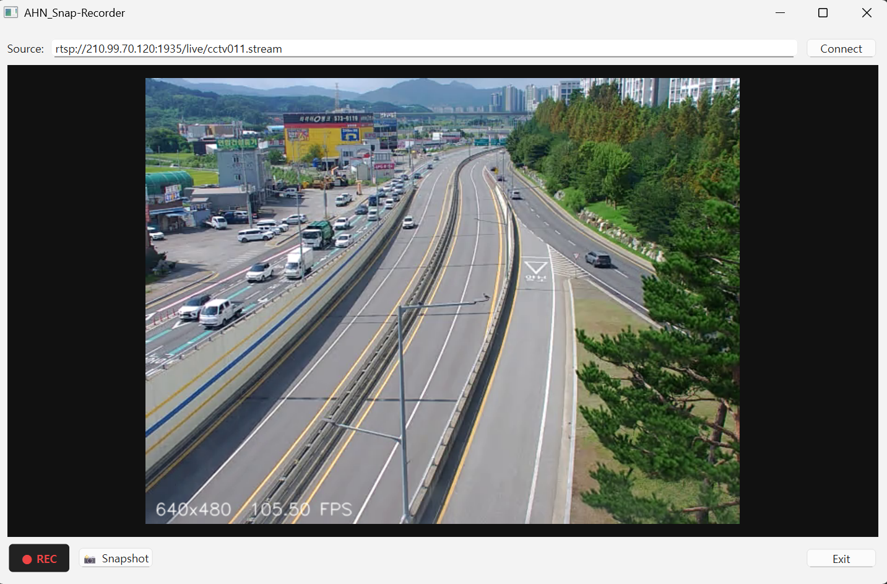
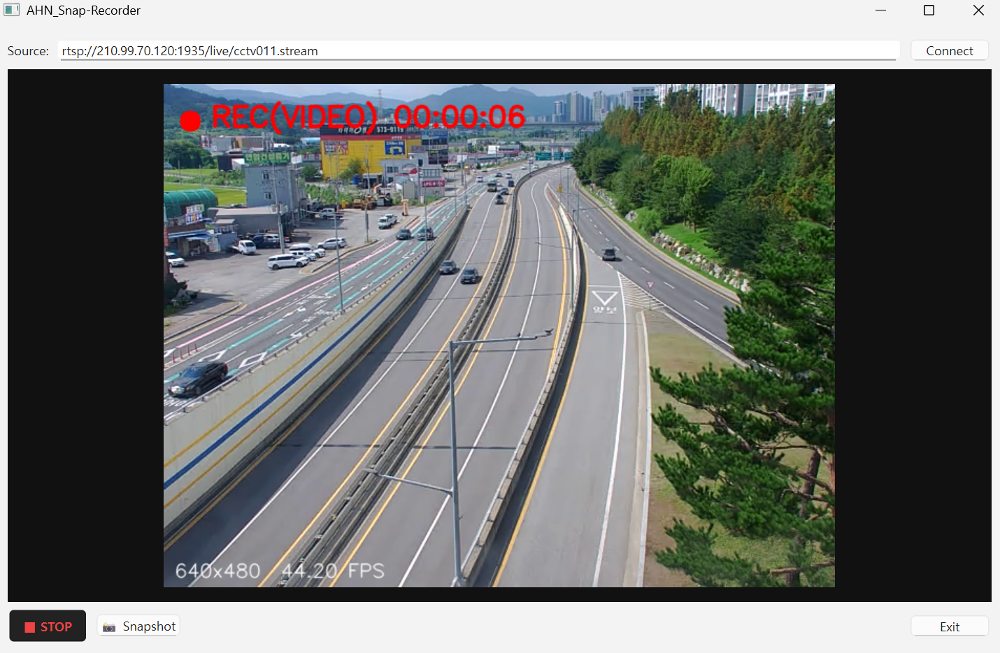

# AHN_Snap-Recorder
OpenCV + PySide6 GUI video recorder (Preview/Record, Snapshot, Enter-to-Connect)

OpenCV + PySide6 기반 비디오 레코더 GUI. 미리보기, 녹화(빨간 ●/타이머 오버레이), 스냅샷, 단축키(Space/S/ESC), **Enter로 Connect**를 지원

## ✨ Features
- **Preview / Record**: 실시간 미리보기, Space로 녹화 토글 (● + 타이머)
- **동영상 저장**: `cv2.VideoWriter` 사용. 실행 시 코덱 호환성 자동 탐색(MJPG/XVID/MP4V 등)
- **스냅샷**: 현재 프레임을 PNG로 저장
- **키 바인딩**  
  - `Enter`(Source 입력창): Connect  
  - `Space`: 녹화 시작/정지  
  - `S`: 스냅샷  
  - `ESC`: 종료
- **입력 소스**: `0`(웹캠) 또는 `rtsp://id:pw@ip/stream`

## 🧪 Screenshots / Demo





[Demo video (MP4)](assets/rec_20250915_234256.mp4)

## 📦 Requirements
```bash
pip install opencv-python PySide6


